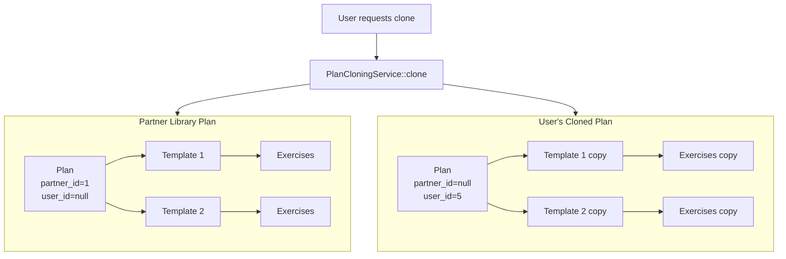

# Plan Types: Routine and Program Implementation

Organized into 6 phases for incremental execution and testing.

---

## Phase 1: Database Layer

**Goal:** Add schema changes and create the PlanType enum.

### 1.1 Create PlanType Enum

Create `app/Enums/PlanType.php`:

```php
enum PlanType: string
{
    case Routine = 'routine';
    case Program = 'program';
}
```

### 1.2 Migration: Plans Table

Create migration to add columns to `plans` table:

- `type` - string, default `'routine'`
- `duration_weeks` - integer, nullable
- `partner_id` - foreignId, nullable, constrained to partners (cascade on delete)

Also make `user_id` nullable (for partner library plans where user_id is null).

### 1.3 Migration: Workout Templates Table

Create migration to add columns to `workout_templates` table:

- `week_number` - integer, default `1`
- `order_index` - integer, default `0`

### Files to Create/Modify

| Action | File |

|--------|------|

| Create | `app/Enums/PlanType.php` |

| Create | `database/migrations/xxxx_add_type_duration_and_partner_to_plans_table.php` |

| Create | `database/migrations/xxxx_add_week_and_order_to_workout_templates_table.php` |

---

## Phase 2: Model Layer

**Goal:** Update Eloquent models with new fields, relationships, and methods.

### 2.1 Update Plan Model

[`app/Models/Plan.php`](app/Models/Plan.php)

- Add to `$fillable`: `type`, `duration_weeks`, `partner_id`
- Add cast: `'type' => PlanType::class`
- Add relationships:
  - `partner(): BelongsTo`
- Add helper methods:
  - `isProgram(): bool`
  - `isRoutine(): bool`
  - `isPartnerLibraryPlan(): bool` (partner_id set, user_id null)
- Add scopes:
  - `scopeForPartner(Builder $query, int $partnerId)` - library plans
  - `scopeForUser(Builder $query, int $userId)` - user's own plans
- Add business logic:
  - `nextWorkout(User $user): ?WorkoutTemplate`
  - `getProgressPercentage(User $user): ?float`

### 2.2 Update Partner Model

[`app/Models/Partner.php`](app/Models/Partner.php)

- Add relationship: `plans(): HasMany` (for partner library plans)

### 2.3 Update WorkoutTemplate Model

[`app/Models/WorkoutTemplate.php`](app/Models/WorkoutTemplate.php)

- Add to `$fillable`: `week_number`, `order_index`
- Add scope: `scopeOrderedByProgram(Builder $query)` - orders by `order_index`

### 2.4 Update Factories

[`database/factories/PlanFactory.php`](database/factories/PlanFactory.php):

- Add `type` default `PlanType::Routine`
- Add `duration_weeks` as null
- Add `partner_id` as null
- Add `program()` state
- Add `partnerLibrary(Partner $partner)` state

[`database/factories/WorkoutTemplateFactory.php`](database/factories/WorkoutTemplateFactory.php):

- Add `week_number` default 1
- Add `order_index` default 0

### Files to Modify

| File |

|------|

| `app/Models/Plan.php` |

| `app/Models/Partner.php` |

| `app/Models/WorkoutTemplate.php` |

| `database/factories/PlanFactory.php` |

| `database/factories/WorkoutTemplateFactory.php` |

---

## Phase 3: Admin Panel CRUD

**Goal:** Update web forms, views, and validation for partner admins.

### 3.1 Update Form Requests

[`app/Http/Requests/StorePlanRequest.php`](app/Http/Requests/StorePlanRequest.php):

```php
public function rules(): array
{
    return [
        'name' => 'required|string|max:255',
        'description' => 'nullable|string',
        'is_active' => 'nullable|boolean',
        'type' => ['required', Rule::enum(PlanType::class)],
        'duration_weeks' => 'nullable|integer|min:1|max:52',
    ];
}
```

[`app/Http/Requests/UpdatePlanRequest.php`](app/Http/Requests/UpdatePlanRequest.php): Same rules.

### 3.2 Update Web Controller

[`app/Http/Controllers/PlanController.php`](app/Http/Controllers/PlanController.php):

- Update `store()` to save `type` and `duration_weeks`
- Update `update()` to save `type` and `duration_weeks`
- Add methods for partner library plans (future):
  - `libraryIndex()` - list partner's library plans
  - `libraryCreate()` - create partner library plan
  - `libraryStore()` - store partner library plan

### 3.3 Update Blade Views

[`resources/views/plans/create.blade.php`](resources/views/plans/create.blade.php):

- Add Plan Type dropdown (Routine/Program)
- Add Duration (weeks) field - conditionally shown when Program selected
- Use Alpine.js for conditional display

[`resources/views/plans/edit.blade.php`](resources/views/plans/edit.blade.php):

- Same fields as create

[`resources/views/plans/show.blade.php`](resources/views/plans/show.blade.php):

- Display plan type badge (Routine/Program)
- Display duration weeks for programs
- For programs: show week/order columns in workout template list

[`resources/views/plans/index.blade.php`](resources/views/plans/index.blade.php):

- Add type badge column

### Files to Modify

| File |

|------|

| `app/Http/Requests/StorePlanRequest.php` |

| `app/Http/Requests/UpdatePlanRequest.php` |

| `app/Http/Controllers/PlanController.php` |

| `resources/views/plans/create.blade.php` |

| `resources/views/plans/edit.blade.php` |

| `resources/views/plans/show.blade.php` |

| `resources/views/plans/index.blade.php` |

---

## Phase 4: API Layer

**Goal:** Update the existing `PlanController` API with separate methods for Routines and Programs. Create separate API resources.

### 4.1 API Architecture

We separate the API into two distinct resources with different capabilities:

- **Routines** (`/api/routines`) - User-created flexible workout collections
- **Programs** (`/api/programs`) - Partner-provided sequential workout roadmaps

Both use the same underlying `Plan` model and same controller, filtered by `type`.

| Feature | Routines | Programs |

|---------|----------|----------|

| Created by | User | Partner (library) |

| Library | No | Yes |

| User can create | Yes | No |

| User can clone | No | Yes |

| Progress tracking | No | Yes |

### 4.2 Routines API

**Users can create their own routines.** No partner library for routines.

**Endpoints:**

| Method | Endpoint | Description |

|--------|----------|-------------|

| GET | `/routines` | List user's routines |

| POST | `/routines` | Create a routine |

| GET | `/routines/{routine}` | View a routine |

| PUT | `/routines/{routine}` | Update a routine |

| DELETE | `/routines/{routine}` | Delete routine |

**Update** [`app/Http/Controllers/Api/PlanController.php`](app/Http/Controllers/Api/PlanController.php):

Add the following methods:

```php
// Routines methods
public function routinesIndex();      // User's routines (type=routine)
public function routinesStore(StoreRoutineRequest $request);  // Create routine
public function routinesShow(Plan $routine);
public function routinesUpdate(UpdateRoutineRequest $request, Plan $routine);
public function routinesDestroy(Plan $routine);
```

**Create** [`app/Http/Requests/Api/StoreRoutineRequest.php`](app/Http/Requests/Api/StoreRoutineRequest.php):

```php
public function rules(): array
{
    return [
        'name' => 'required|string|max:255',
        'description' => 'nullable|string',
        'is_active' => 'nullable|boolean',
    ];
}
```

**Create** [`app/Http/Resources/Api/RoutineResource.php`](app/Http/Resources/Api/RoutineResource.php):

```php
return [
    'id' => $this->id,
    'name' => $this->name,
    'description' => $this->description,
    'is_active' => $this->is_active,
    'workout_templates' => WorkoutTemplateResource::collection($this->whenLoaded('workoutTemplates')),
    'created_at' => $this->created_at,
    'updated_at' => $this->updated_at,
];
```

### 4.3 Programs API

**Users cannot create programs.** They clone from partner library only.

**Endpoints:**

| Method | Endpoint | Description |

|--------|----------|-------------|

| GET | `/programs` | List user's programs (cloned) |

| GET | `/programs/library` | Browse partner library programs |

| GET | `/programs/{program}` | View program (with progress) |

| PATCH | `/programs/{program}` | Toggle is_active only |

| DELETE | `/programs/{program}` | Remove program |

| POST | `/programs/{program}/clone` | Clone library program |

| GET | `/programs/{program}/next-workout` | Get next workout |

**Update** [`app/Http/Controllers/Api/PlanController.php`](app/Http/Controllers/Api/PlanController.php):

Add the following methods:

```php
// Programs methods
public function programsIndex();      // User's programs (cloned, type=program)
public function programsLibrary();    // Partner library programs
public function programsShow(Plan $program);
public function programsUpdate(Request $request, Plan $program);  // is_active only
public function programsDestroy(Plan $program);
public function programsClone(Plan $program, PlanCloningService $service);
public function programsNextWorkout(Plan $program);  // Program-specific
```

**Create** [`app/Http/Resources/Api/ProgramResource.php`](app/Http/Resources/Api/ProgramResource.php):

```php
return [
    'id' => $this->id,
    'name' => $this->name,
    'description' => $this->description,
    'duration_weeks' => $this->duration_weeks,
    'is_active' => $this->is_active,
    'is_library_plan' => $this->isPartnerLibraryPlan(),
    'progress_percentage' => $this->when(
        $this->user_id,
        fn() => $this->getProgressPercentage(auth()->user())
    ),
    'next_workout' => $this->when(
        $this->user_id,
        fn() => new WorkoutTemplateResource($this->nextWorkout(auth()->user()))
    ),
    'workout_templates' => WorkoutTemplateResource::collection($this->whenLoaded('workoutTemplates')),
    'created_at' => $this->created_at,
    'updated_at' => $this->updated_at,
];
```

### 4.4 Update WorkoutTemplateResource

[`app/Http/Resources/Api/WorkoutTemplateResource.php`](app/Http/Resources/Api/WorkoutTemplateResource.php):

- Add `week_number`
- Add `order_index`

### 4.5 Update API Routes

[`routes/api.php`](routes/api.php):

Replace the existing `Route::apiResource('plans', PlanController::class);` with:

```php
// Routines API - User can create/manage their own
Route::prefix('routines')->group(function () {
    Route::get('/', [PlanController::class, 'routinesIndex']);
    Route::post('/', [PlanController::class, 'routinesStore']);
    Route::get('/{routine}', [PlanController::class, 'routinesShow']);
    Route::put('/{routine}', [PlanController::class, 'routinesUpdate']);
    Route::delete('/{routine}', [PlanController::class, 'routinesDestroy']);
});

// Programs API - User clones from partner library
Route::prefix('programs')->group(function () {
    Route::get('/', [PlanController::class, 'programsIndex']);
    Route::get('/library', [PlanController::class, 'programsLibrary']);
    Route::get('/{program}', [PlanController::class, 'programsShow']);
    Route::patch('/{program}', [PlanController::class, 'programsUpdate']);
    Route::delete('/{program}', [PlanController::class, 'programsDestroy']);
    Route::post('/{program}/clone', [PlanController::class, 'programsClone']);
    Route::get('/{program}/next-workout', [PlanController::class, 'programsNextWorkout']);
});
```

### 4.6 Keep Existing Methods

**Keep** the existing methods in [`app/Http/Controllers/Api/PlanController.php`](app/Http/Controllers/Api/PlanController.php):
- `index()`, `store()`, `show()`, `update()`, `destroy()` - can be deprecated or kept for backward compatibility

**Update** [`app/Http/Resources/Api/PlanResource.php`](app/Http/Resources/Api/PlanResource.php) with new fields for admin panel use.

### Files to Create/Modify

| Action | File |

|--------|------|

|| Modify | `app/Http/Controllers/Api/PlanController.php` |


| Create | `app/Http/Requests/Api/StoreRoutineRequest.php` |

| Create | `app/Http/Requests/Api/UpdateRoutineRequest.php` |

| Create | `app/Http/Resources/Api/RoutineResource.php` |

| Create | `app/Http/Resources/Api/ProgramResource.php` |

| Modify | `app/Http/Resources/Api/PlanResource.php` |

| Modify | `app/Http/Resources/Api/WorkoutTemplateResource.php` |

| Modify | `routes/api.php` |


---

## Phase 5: Plan Cloning Service

**Goal:** Create the service that powers plan cloning. The API endpoint (`POST /plans/{id}/clone`) was added in Phase 4 routes, but needs this service to function.

### 5.1 Create PlanCloningService

Create [`app/Services/PlanCloningService.php`](app/Services/PlanCloningService.php):

```php
class PlanCloningService
{
    public function clone(Plan $sourcePlan, User $targetUser): Plan
    {
        return DB::transaction(function () use ($sourcePlan, $targetUser) {
            // 1. Clone the plan
            $newPlan = $sourcePlan->replicate(['id', 'created_at', 'updated_at']);
            $newPlan->user_id = $targetUser->id;
            $newPlan->partner_id = null; // User now owns their copy
            $newPlan->is_active = false;
            $newPlan->save();

            // 2. Clone workout templates
            foreach ($sourcePlan->workoutTemplates as $template) {
                $newTemplate = $template->replicate(['id', 'created_at', 'updated_at']);
                $newTemplate->plan_id = $newPlan->id;
                $newTemplate->save();

                // 3. Clone workout template exercises
                foreach ($template->workoutTemplateExercises as $exercise) {
                    $newExercise = $exercise->replicate(['id', 'created_at', 'updated_at']);
                    $newExercise->workout_template_id = $newTemplate->id;
                    $newExercise->save();
                }
            }

            return $newPlan->fresh(['workoutTemplates.workoutTemplateExercises']);
        });
    }
}
```

### 5.2 Integrate with PlanController

The `programsClone()` method in `PlanController` (added in Phase 4) will use this service.

Note: Only Programs have cloning (from partner library). Routines are user-created directly.

```php
// In PlanController
public function programsClone(Plan $program, PlanCloningService $service): JsonResponse
{
    // Verify this is a library plan (partner-owned)
    if (!$program->isPartnerLibraryPlan()) {
        return response()->json(['message' => 'Only library programs can be cloned'], 403);
    }

    $clonedPlan = $service->clone($program, auth()->user());

    return response()->json([
        'message' => 'Program cloned successfully',
        'data' => new ProgramResource($clonedPlan->load('workoutTemplates')),
    ], 201);
}
```

### Cloning Flow Diagram



### Files to Create

| Action | File |

|--------|------|

| Create | `app/Services/PlanCloningService.php` |

---

## Phase 6: Documentation & Tests

**Goal:** Update API documentation and create comprehensive tests.

### 6.1 Update API Documentation

[`API_DOCUMENTATION.md`](API_DOCUMENTATION.md):

**Major API changes:**

1. **Remove** all `/api/plans` endpoints (replaced by separate routines/programs)
2. **Add** `/api/routines` endpoints for flexible workout collections
3. **Add** `/api/programs` endpoints for sequential workout roadmaps

**Replace Plans section with two new sections:**

**Routines API Quick Reference (User-created):**

| Method | Endpoint | Description |

|--------|----------|-------------|

| GET | `/api/routines` | List user's routines |

| POST | `/api/routines` | Create a routine |

| GET | `/api/routines/{id}` | Get single routine |

| PUT | `/api/routines/{id}` | Update routine |

| DELETE | `/api/routines/{id}` | Delete routine |

**Programs API Quick Reference (Partner-provided):**

| Method | Endpoint | Description |

|--------|----------|-------------|

| GET | `/api/programs` | List user's programs (cloned) |

| GET | `/api/programs/library` | Browse partner library programs |

| GET | `/api/programs/{id}` | Get program with progress |

| PATCH | `/api/programs/{id}` | Toggle is_active only |

| DELETE | `/api/programs/{id}` | Remove program |

| POST | `/api/programs/{id}/clone` | Clone library program |

| GET | `/api/programs/{id}/next-workout` | Get next workout |

**Add new TypeScript interfaces:**

```typescript
// Routines - User-created flexible workout collections
interface RoutineResource {
  id: number;
  name: string;
  description: string | null;
  is_active: boolean;
  workout_templates: WorkoutTemplateResource[] | null;
  created_at: string;
  updated_at: string;
}

// Create/Update routine request
interface StoreRoutineRequest {
  name: string;           // required, max 255
  description?: string;   // optional
  is_active?: boolean;    // optional, defaults false
}

// Programs - Partner-provided sequential workout roadmaps
interface ProgramResource {
  id: number;
  name: string;
  description: string | null;
  duration_weeks: number | null;
  is_active: boolean;
  is_library_plan: boolean;  // true = partner library, false = user's cloned copy
  progress_percentage: number | null;  // Calculated from completed templates
  next_workout: WorkoutTemplateResource | null;
  workout_templates: WorkoutTemplateResource[] | null;
  created_at: string;
  updated_at: string;
}

interface WorkoutTemplateResource {
  // ... existing fields ...
  week_number: number;   // For programs: which week
  order_index: number;   // For programs: sequence order
}

// Clone response (programs only)
interface CloneProgramResponse {
  message: "Program cloned successfully";
  data: ProgramResource;  // The user's new cloned program
}

// Next workout response (programs only)
interface NextWorkoutResponse {
  data: WorkoutTemplateResource | null;  // null if program completed
}
```

### 6.2 Create Feature Tests

Create [`tests/Feature/PlanTypesTest.php`](tests/Feature/PlanTypesTest.php):

- `test_can_create_routine_plan()`
- `test_can_create_program_plan_with_duration()`
- `test_can_update_plan_type()`
- `test_next_workout_returns_first_for_new_program()`
- `test_next_workout_returns_next_after_completion()`
- `test_next_workout_returns_null_when_program_completed()`
- `test_progress_percentage_calculation()`

Create [`tests/Feature/PlanCloningTest.php`](tests/Feature/PlanCloningTest.php):

- `test_can_clone_program_from_library()`
- `test_cloning_copies_all_templates_and_exercises()`
- `test_cloning_partner_plan_clears_partner_id()`
- `test_cloning_sets_user_id_to_target_user()`
- `test_cloned_plan_is_inactive_by_default()`
- `test_cannot_clone_non_library_plan()`

Create [`tests/Feature/RoutineApiTest.php`](tests/Feature/RoutineApiTest.php):

- `test_user_can_create_routine()`
- `test_user_can_list_own_routines()`
- `test_user_can_update_own_routine()`
- `test_user_can_delete_own_routine()`
- `test_user_cannot_access_other_users_routines()`

Create [`tests/Feature/ProgramApiTest.php`](tests/Feature/ProgramApiTest.php):

- `test_user_can_list_own_programs()`
- `test_user_can_view_library_programs()`
- `test_user_can_clone_library_program()`
- `test_user_cannot_create_program_directly()`
- `test_user_can_only_toggle_is_active()`

### Files to Create/Modify

| Action | File |

|--------|------|

| Modify | `API_DOCUMENTATION.md` |

| Create | `tests/Feature/PlanTypesTest.php` |

| Create | `tests/Feature/PlanCloningTest.php` |

| Create | `tests/Feature/RoutineApiTest.php` |

| Create | `tests/Feature/ProgramApiTest.php` |

---

## Complete File Summary

| Phase | Action | File |

|-------|--------|------|

| 1 | Create | `app/Enums/PlanType.php` |

| 1 | Create | `database/migrations/xxxx_add_type_duration_and_partner_to_plans_table.php` |

| 1 | Create | `database/migrations/xxxx_add_week_and_order_to_workout_templates_table.php` |

| 2 | Modify | `app/Models/Plan.php` |

| 2 | Modify | `app/Models/Partner.php` |

| 2 | Modify | `app/Models/WorkoutTemplate.php` |

| 2 | Modify | `database/factories/PlanFactory.php` |

| 2 | Modify | `database/factories/WorkoutTemplateFactory.php` |

| 3 | Modify | `app/Http/Requests/StorePlanRequest.php` |

| 3 | Modify | `app/Http/Requests/UpdatePlanRequest.php` |

| 3 | Modify | `app/Http/Controllers/PlanController.php` |

| 3 | Modify | `resources/views/plans/create.blade.php` |

| 3 | Modify | `resources/views/plans/edit.blade.php` |

| 3 | Modify | `resources/views/plans/show.blade.php` |

| 3 | Modify | `resources/views/plans/index.blade.php` |

|| 4 | Modify | `app/Http/Controllers/Api/PlanController.php` |


| 4 | Create | `app/Http/Requests/Api/StoreRoutineRequest.php` |

| 4 | Create | `app/Http/Requests/Api/UpdateRoutineRequest.php` |

| 4 | Create | `app/Http/Resources/Api/RoutineResource.php` |

| 4 | Create | `app/Http/Resources/Api/ProgramResource.php` |

| 4 | Modify | `app/Http/Resources/Api/PlanResource.php` |

| 4 | Modify | `app/Http/Resources/Api/WorkoutTemplateResource.php` |

| 4 | Modify | `routes/api.php` |


| 5 | Create | `app/Services/PlanCloningService.php` |

| 6 | Modify | `API_DOCUMENTATION.md` |

| 6 | Create | `tests/Feature/PlanTypesTest.php` |

| 6 | Create | `tests/Feature/PlanCloningTest.php` |

| 6 | Create | `tests/Feature/RoutineApiTest.php` |

| 6 | Create | `tests/Feature/ProgramApiTest.php` |
